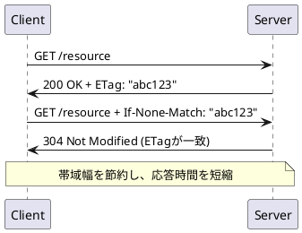

## ETag検証とは

ETag検証は、HTTPリソースのバージョンを識別するための仕組み。
リソースが変更されたかどうかを効率的に確認するために使用される。

## 基本原理
- ETag:
    - リソースの一意な識別子（ハッシュ値やバージョン文字列）

- If-None-Match:
    - クライアントが持つETagをサーバーに送信

- 304 Not Modified:
    - ETagが一致した場合、サーバーはコンテンツなしで304を返却

https://deepwiki.com/search/stalewhilerevalidate_93590ccc-493a-466b-a331-1f098e11c922?mode=fast

---

## 注意点（運用上）
    - `local.properties` や `.env` に `GITHUB_TOKEN=...` を置き、`.gitignore` に入れる

- Personal Access Token を直接ソースに書かないこと
- AI ツール使用箇所は README に記載すること（どの部分で・なぜ使用したか）

---

## 動作確認 / 実行方法

### 必要環境
- JDK 11+
- Android Studio Flamingo 以上推奨
- Gradle 7+

### 環境変数 / トークン
GitHub API のレートや一部エンドポイントでトークンが必要な場合があります。  
ローカルでの実行は下記を `local.properties`（プロジェクトルート）に追加してください（`.gitignore` に追加済み）

## 実行手順
1. リポジトリをクローン
2. Android Studio で開く
3. `local.properties` に `GITHUB_TOKEN` を追加（必要な場合）
4. Build → Run

## 提出手順
1. プライベートリポジトリを作成
2. 以下のユーザを Collaborator に追加:
    - `kubode`
    - `miyu-recruiter`
    - `MizuTakeuchi`
    - `Nagao-hikaru`
    - `yuya-h-29`
3. ソース一式と下のドキュメントを配置
4. リポジトリ URL を提出

